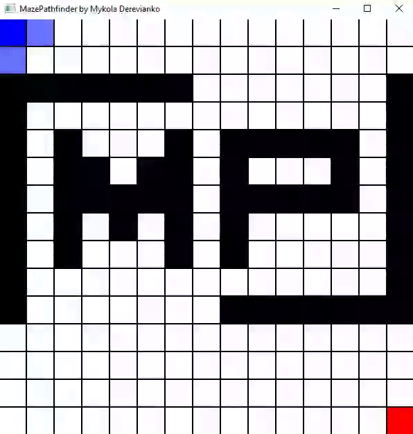

# 🧩 Interactive Maze Pathfinder (BFS Visualization)

An interactive maze pathfinding visualizer using **Breadth-First Search (BFS)** built with **C++** and **SFML**.  
Draw your own maze, set custom start and end points, and watch BFS find the shortest path in real-time.

## 🎥 Demo

Watch BFS find the shortest path in real-time!


---

## 🚀 Features

- 🖱️ **Mouse Drawing** – Click to create or remove walls
- 🎯 **Custom Start/End Points** – Right-click to set start and end positions
- 🔍 **BFS Visualization** – Visualize how BFS explores the grid
- ♻️ **Reset and Retry** – Press `R` to clear and draw a new maze

---

## 🛠️ Customization

You can easily tweak:

- **Grid size** – Change dimensions in the source code
- **Colors** – Modify how visited, path, walls, etc. are rendered
- **Algorithm speed** – Add a small delay in the visualization loop for step-by-step rendering

---

## 🧠 How It Works

- The grid is made up of cells that can be walls, empty spaces, start or end points.
- BFS explores each neighboring cell layer by layer, ensuring the shortest path is found.
- The algorithm uses a queue and visits all adjacent unvisited cells.
- Each cell is visually colored based on its current state (visited, path, etc.).

---

## 🕹️ Controls

| Action                | Control                  |
|-----------------------|--------------------------|
| Toggle Wall           | **Left Click**           |
| Set Start/End Point   | **Right Click** (alternates) |
| Start BFS             | **Enter**                |
| Reset Maze            | **R**                    |
| Exit Program          | **Close the window**     |

---

## 🧱 Requirements

- **C++17 or newer**
- **SFML 2.4+**

---

## 🧰 Build & Run

### 1. Clone the repository

```bash
git clone https://github.com/mykola-derevianko/maze-pathfinder.git
cd maze-pathfinder
```

### 2. Build the project
Make sure SFML is installed and linked properly.

#### 🟡 Linux / macOS (g++)
```bash
g++ -std=c++17 -o MazePathfinder main.cpp -lsfml-graphics -lsfml-window -lsfml-system -pthread
./maze
```

#### 🔵 Windows (MinGW)
```bash
g++ -std=c++17 main.cpp -o MazePathfinder.exe -lsfml-graphics -lsfml-window -lsfml-system -pthread
MazePathfinder.exe
```

Or use your preferred build system (CMake, Makefile, etc.)

---

## 🤭 Future Improvements

- ✅ Add DFS / A* support
- 🔄 Add maze generation algorithms
- 📅 Load/Save maze states
- 🎨 GUI enhancements
---

## 🤝 Contributing

Pull requests are welcome! For major changes, please open an issue first  
to discuss what you would like to change.

---

## 💬 Feedback

If you find bugs or have suggestions, feel free to open an [issue](https://github.com/mykola-derevianko/maze-pathfinder/issues).

---
